# 一个全平台应用的诞生

今天我们通过一个简单的Todo项目来看一下基于Web开发的全平台应用的全过程。主要目的是为大家建立全局视野，可能会遇到一些听不懂的技术名词，不懂没关系，先接着看下去，感受整个过程就对了。后边会把这些知识点补充起来的。

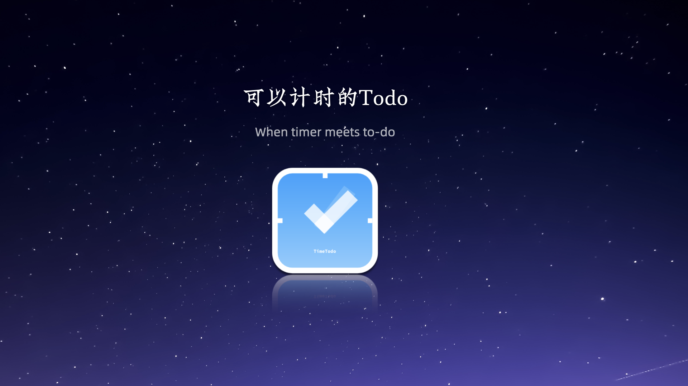
Time Todo是我开发的一个Todo工具。它既有电脑客户端、又有网页版和移动版。还可以通过Web Hook进行Todo数据同步和生成日报等工作，主体应用从想法到完成只用了一个周末。

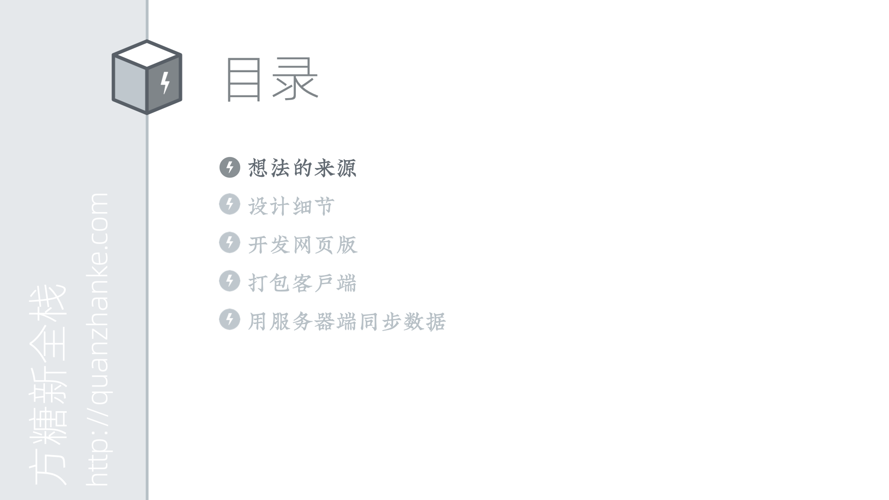
下边我们就从想法讲起。之所以想开发这么一个应用，主要还是来自于日常的需求。
我是一个非常喜欢用Todo的人，这可能是因为我记性不太好。但是市面上的Todo应用并不是为一个重度迷糊症患者设计的。

第一，大部分的Todo电脑客户端是不支持一直浮动在顶层的。这让我很诧异，因为浮动在顶层很重要。如果Todo不能一直在最上边，那么它被遮挡后，我很可能会忘掉还有这个东西。
第二，大部分的Todo应用只有「待完成」和「已经完成」状态，没有「正在进行中」。
这样当我被电话打断后再回到工作状态时，就需要从一堆Todo里去找正在做的事情。

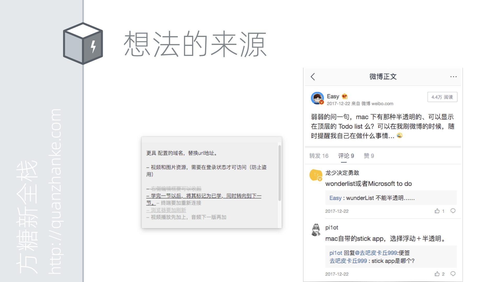
如果你是一个普通用户，那么只能到处去找现成的解决方案。比如Mac系统的便签在一定程度上符合了这个需求，它能浮动在顶层、也能透明，但它毕竟不是一个Todo应用，不能很便捷的划掉其中一项。当你拥有编程能力以后，就会多出来一个选择，那就是自己写。自己写的应用能完全符合自己的需求，让你的工作和生活会更加的完美。而不是活在一个「又不是不能用」的世界里。

那么既然决定做了，我们就需要梳理一下之前的需求。

首先它得是一个Todo，可以添加，可以划掉的那种。
然后它需要支持顶层浮动、可以半透明。
同时，它可以高亮当前正在处理的那一条Todo。

这里问题就来了，怎么才能知道当前在处理哪条呢？
我们用个土方法，就是手工点。开始任务的时候点一下，结束的时候点一下。

这样比较准确，而且有意思的是，它还带来了一个附加价值，那就是计时。
之前在公司经常会被要求需要写日报周报，每项任务会要求写开发时间。这种场景下计时功能就很实用了。

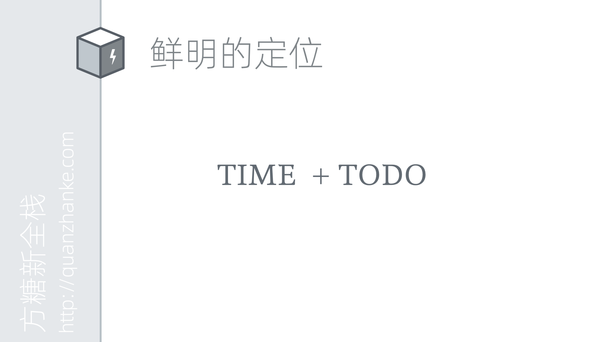
然后我们需要给这个应用一个鲜明的定位。一般在大公司做开发时不会遇到这类任务，但在独立开发中，这个定位甚至可能决定它的下载量。
现在Todo应用已经非常多了，可能是因为写起来很简单，那些前端框架都用Todo做Demo，简直就是框架界的「Hello World」了。
所以我们需要突出这个应用与众不同的地方。

回顾一下我们的核心需求点，计时是一个亮点，可以用来重点突出下。最简单又最有效的方式就是把这个亮点弄到名字里边。
它是一个可以计时的Todo。我们简单的把「时间」和「Todo」合到一起，就是「Time Todo」。

下边我们来进一步设计一下这个品牌。

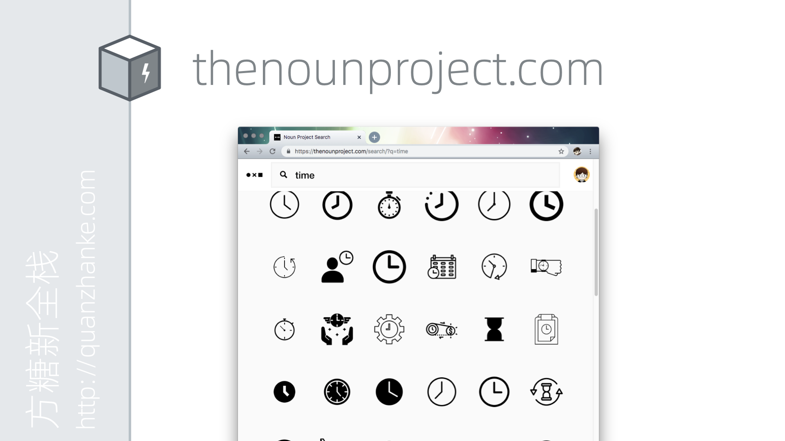
我一般喜欢从Logo开始设计。从之前的思路往下走，我们做的是融合了「时间」和「Todo」的产品。它的图标应该是什么样子呢？让我们到图标网站thenounproject.com去寻找下灵感，分别输入time和todo，看看对应的图案都有哪些。

我们可以看到，Time的代表图像主要是clock，而Todo的代表图像主要是check box。
我们的任务就是，设计一个图标，同时包含这两个因素。仔细观察两种图标，我们会发现check box的形状其实和钟表的指针很像。那我们如果把二者给融合起来会是什么效果呢。这时候就需要通过设计工具来测试下我们的想法。

我最常用的就是Adobe家的Xd。这是一个矢量设计工具，可以同时用来设计Logo和软件界面。拥有Windows和Mac版本，而且是免费的。

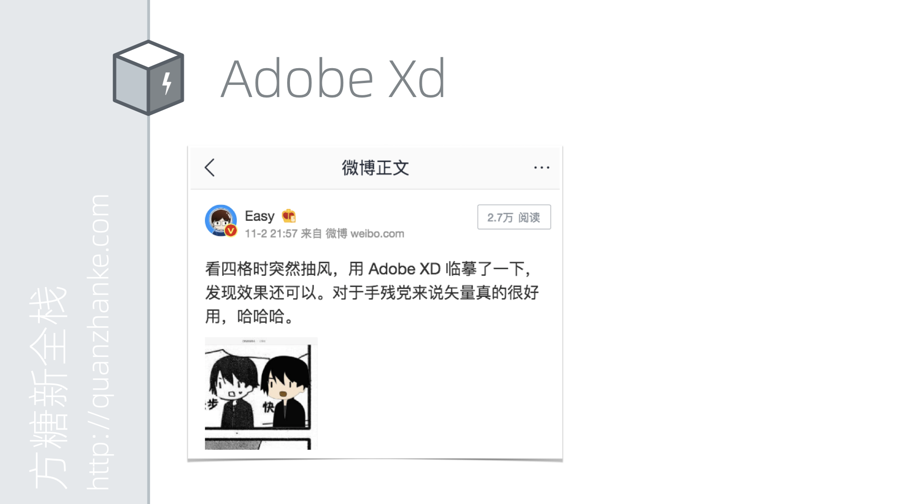
我很喜欢用这个软件，甚至用它临摹过四格漫画里的小人。

2019年国庆期间做的将PPT直接转为视频的「Slide酱」也是用它画的看板娘。矢量设计软件最方便的地方是，当你修改形状时，描边会随之更新。这样因为手残无法画出准确线条的同学，比如我，只要慢慢调整曲线，总能得到自己想要的图案。

下边我们简单看下如何用它来设计Logo。画个正方形，拖动角落的小圆圈控制弧度，使其变成圆角。

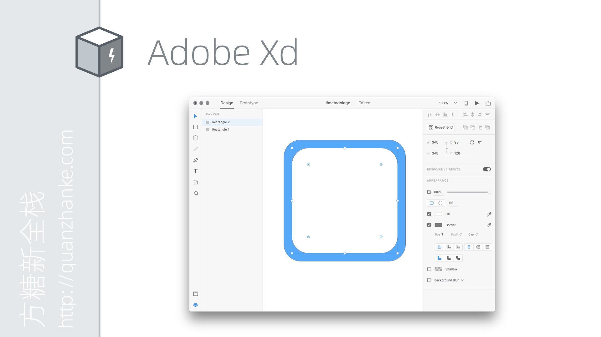
填充蓝色，放入小一号的圆角正方形。表盘完成。

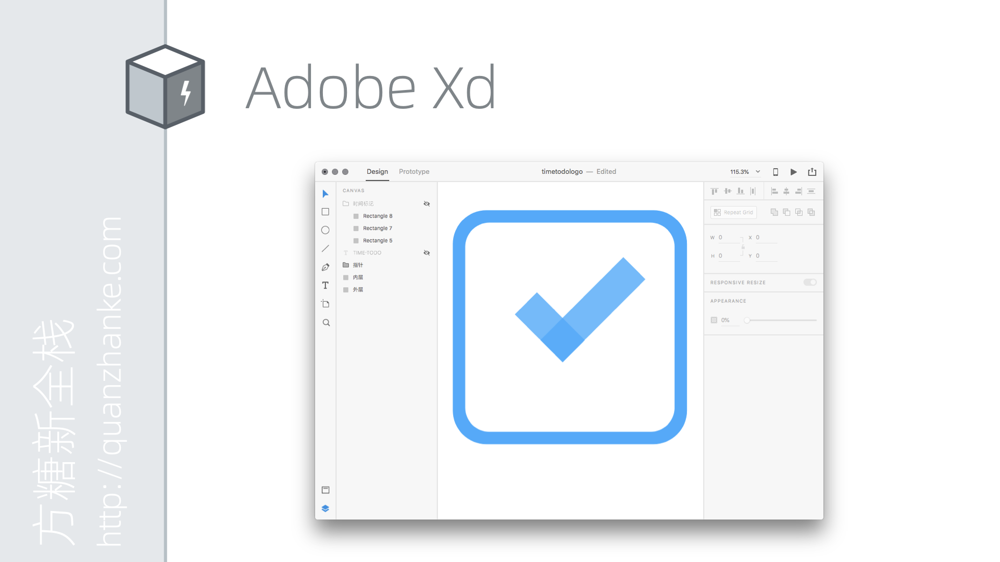
添加指针。采用矩形加半透明，使其同时看起来又像是check box里的勾。

进一步补充细节，添加时间刻度和品牌标识。

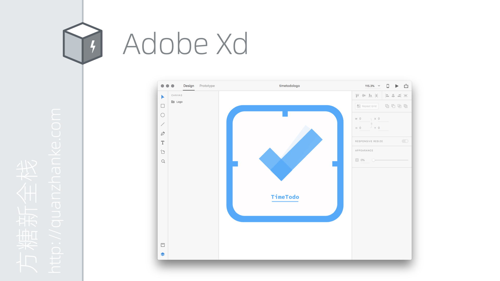
再优化一下细节。把时间标记和边框整合到一起，让图案更简洁一些。给分针添加残影，表示它在旋转。

观察以后觉得不够重，于是决定把配色翻转下，同时给蓝底加上渐变，增加层次感。
这样Logo就设计完了。

将Logo的风格应用到Todo上边，我们就可以设计出类似这样的原型。

接下来我们进入开发阶段。首先要开发的是网页版。为什么是网页版。前边也说过，我们采用的技术栈是以Web技术为核心的。先做网页版，然后将网页版打包，就有了电脑和手机客户端。

复习一下我们之前讲过的B/S联机软件的结构。可以看到在现代浏览器里边，界面、前端逻辑和数据存储都是可以完成的。

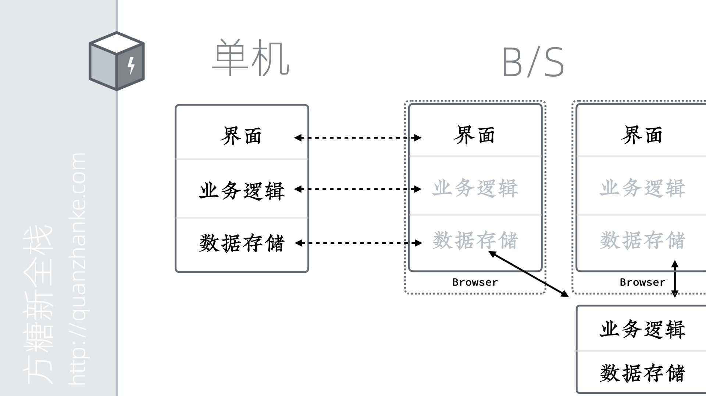
这意味着，其实单机软件能做的事情，浏览器其实也能做。虽然在浏览器里，能调用的接口和能存储的数据都会受到限制，但对于简单的应用已经足够了。

仔细分析下原型就会发现，其实整个界面挺简单的，它只有三部分。新Todo输入框、Todo列表和已完成Todo列表。

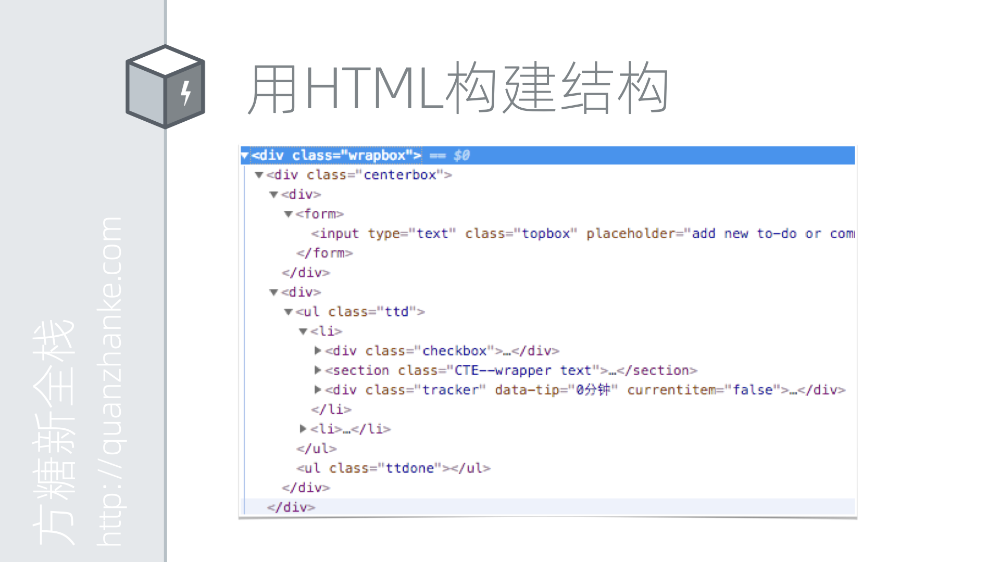
首先我们会通过HTML，也就是超文本标记语言来构建整个页面的结构。比如通过div图层标签作为容器，通过ul无顺序列表标签来列出Todo项目。

这就是纯粹通过HTML构造出来的界面。显然这和我们的原型相差甚远。这是因为我们还没有添加样式。

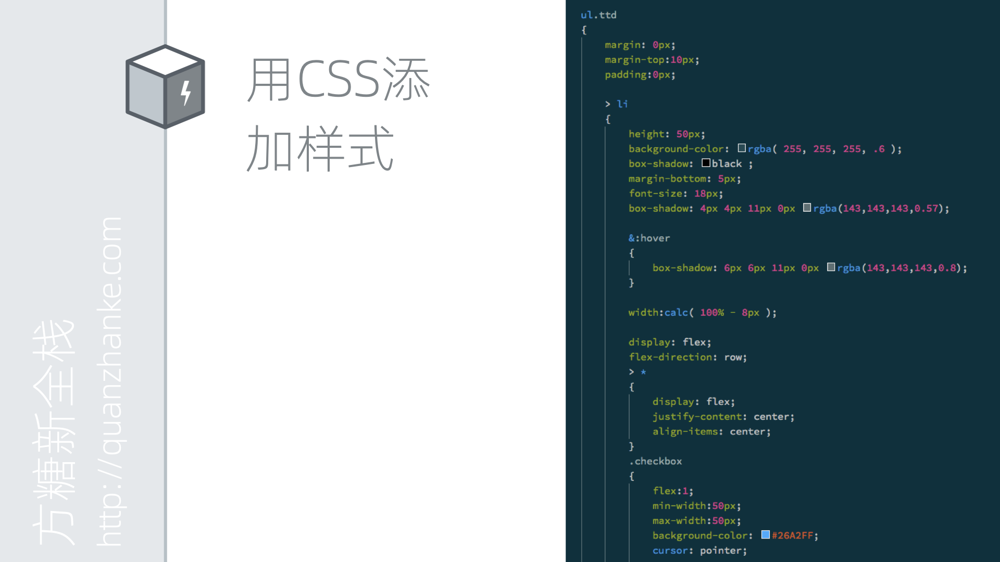
接下来我们通过CSS，也就是层叠式样式表，来给页面加上样式。CSS主要描述每一个标签应该对应什么样的样式。比如高多少、边框多少、要不要阴影等。

这是我们添加完样式的效果，和原型已经非常接近了。通过HTML和CSS，我们就完成了界面构成。但是这个界面是没有灵魂的，因为它还不会动。

这时候我们就需要使用JavaScript语言来描述逻辑。比如当在输入框里边按回车键时，要将内容添加到Todo列表里边去。比如当点击列表项前边的勾型图标时，应该将Todo标记为已完成状态。JavaScript除了能对HTML、CSS进行控制，也可以调用浏览器提供的接口，比如它可以将Todo的内容写入到浏览器的localStorage存储中，这样下次打开这个网页时，上次写的内容还可以显示出来。

这是我们网页版开发完成后的最终效果。大家可以访问官网上的网页版链接，自己感受下。

在完成了网页版以后，其实我们的工具已经可以在电脑和手机上使用了。因为它们都有浏览器。而采用Web技术开发的应用，在这些浏览器上都能工作得很好。那为什么还要打包呢？打包是为了提升体验。比如通过浏览器使用，每次都要输入网页或者打开书签；浏览器标签页又很多，经常会不小心关掉。最重要的是，TimeTodo的需求里边，是希望半透明的浮动在顶层。这个功能单纯的调用浏览器接口是做不到。

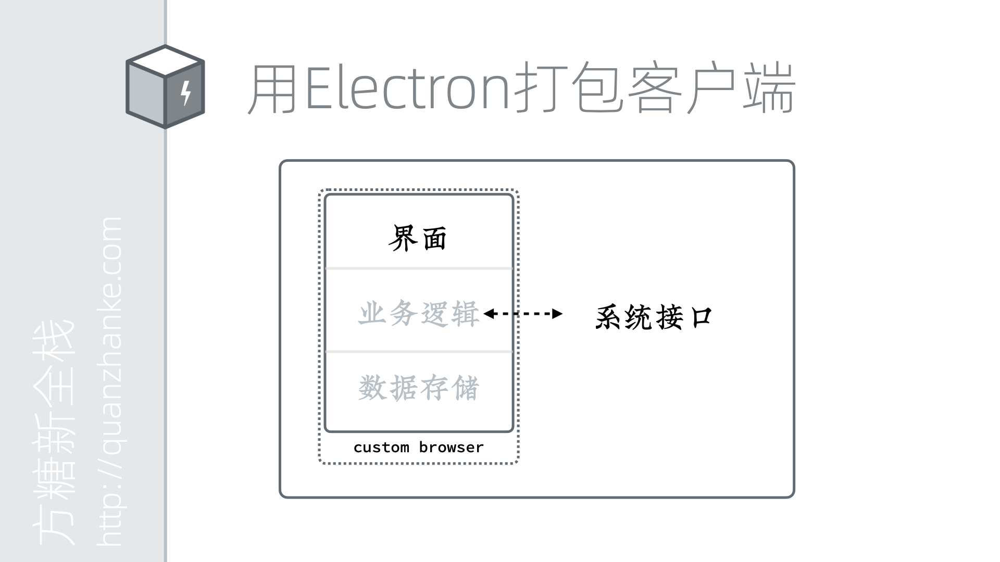
这时候，我们就会转向使用混合应用解决方案。比如Electron。
这种方案的原理其实也很简单。
首先，你可以认为它提供了一个没有多余界面的浏览器，没有地址栏、没有前进后退、只有一个纯粹的窗体。它可以单独启动。这样从用户角度看，就是一个独立的应用了。只不过说和其他原生应用相比，它只能操作浏览器里边的接口和数据。

但是这个包在外边的浏览器并不是标准的浏览器，而是Electron自己的浏览器。它定制一些JavaScript可以访问的接口，把它和操作系统接口对接起来。这样这个包在里边的Web应用，也就具备了一些系统级别的能力。

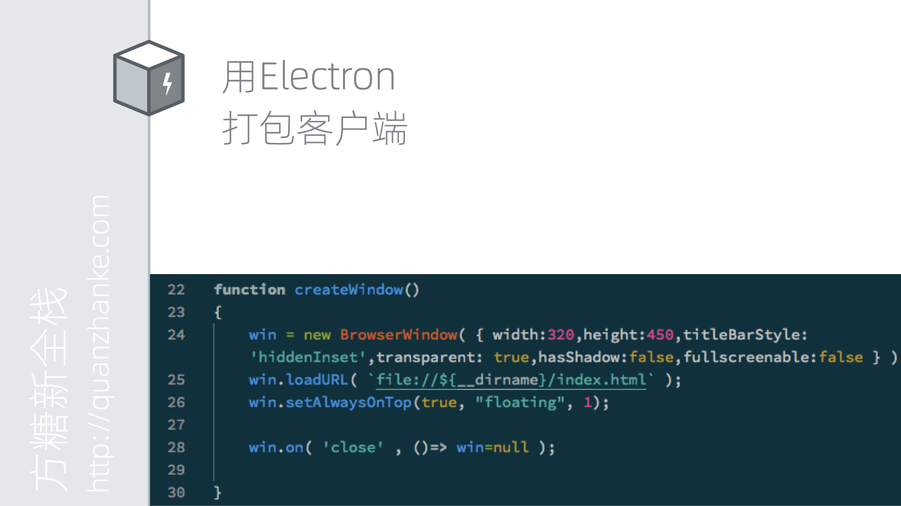
比如这段JavaScript，它就让我们可以创建一个总是浮动在顶层的透明窗口。

通过这种方式，我们完成了Mac和Windows版本的开发。它最终看起来像这样子。Linux下因为驱动问题，窗体无法透明。但Linux用户可以直接使用网页版。我们也可以通过类似的方式，用Cordova将网页版打包为iOS和Android应用，这样就覆盖了移动端。

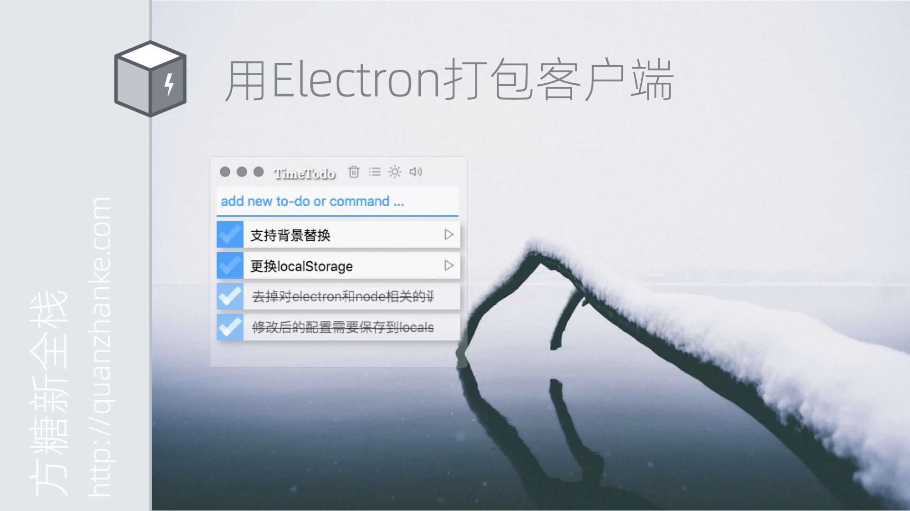
到现在，我们的全平台应用看起来就开发完了。

但在实际使用中，我们会发现，各个平台的数据是割裂的。当我们从Mac换到Windows上时，两个应用上的Todo内容是完全不同的。我们需要将数据同步，需要将数据放一份到服务器端，这就是说，它需要从单机软件变成C/S或B/S结构。

我们最终采用的是这样的结构。首先通过NodeJS或者PHP来实现服务器端的逻辑和存储。
然后不管是网页版还是客户端版，都以同样的规范和服务器进行通信。因为客户端其实是网页版打包的，所以这一点很容易做到。只要简单的使用Ajax这种基于JavaScript的异步传输技术就可以。

我们将的输入框重用起来，让它可以输入命令。具体来说，当我们发现Todo的内容是以冒号开头时，我们就认为这是一条命令。当这个命令是save的时候，我们将Todo里列表发送到服务器端，服务器把它存到数据库或者其他存储里。让这个命令是load的时候，服务器查找上次存入的内容，然后返回给客户端，客户端把它更新到本地、也就是浏览器内部的存储里。在Mac上save一下，到Windows上load就可以接着干活了。这样通过输入命令，我们就实现了在多个平台之间的数据同步。

让我们来回顾一下这个过程。首先我们开发了网页版；然后通过Electron和Cordova打包了电脑客户端和手机客户端；最后通过服务器端实现了网页版和客户端之间的通信。从而实现了一个真正意义上的全平台应用。
