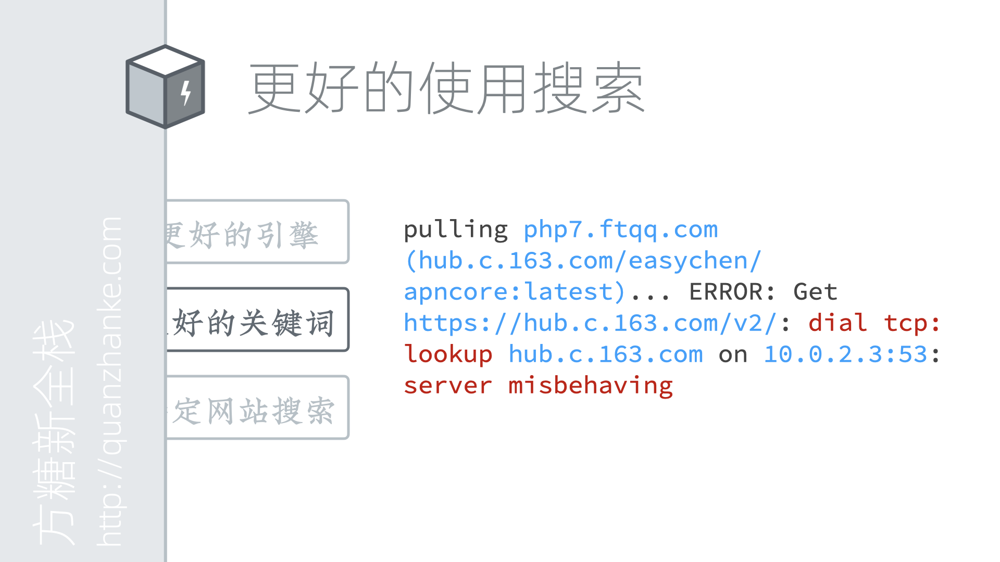

# 技术通识课

在往下学习之前，我们先来学习一些关于学习本身的知识。这些知识将帮助我们更好的发现问题、解决问题。

这里我们主要讲三个问题，先搜后问、正确提问和问题定位。之所以专门拿出来讲，是因为在以往的学习过程中，我们发现很多同学没有养成良好的对待问题的习惯。这些习惯影响了他们的学习进度。下边我们一个个来说。

和我们在学校课堂上的学习不同，现今工作中的大部分问题其实都是通过搜索引擎来完成的。有些同学可能不明白，为什么我身边有人张口就可以问的时候，还要自己去搜索。

这首先是一个内在能力和外在能力的区别。
我们知道，人都是不可靠的。心情好的时候，可能工作效率就高。心情不好的时候，可能工作效率就低。身体不舒服的时候，一个资深工程师也可能连连犯错。相比之下，机器要可靠很多。所以，当我们有问题时，如果总是通过问别人来解决，这就对人产生了依赖。你的能力是依赖于这个人的。哪天这人不在你身边，你问不到的时候，你就废了。而如果我们学会了通过搜索解决问题，只要能上网，我们就可以解决问题，不用再看人眼色。

另一方面，人是有一个交互过程的。你问、我答，这之间是有等待时间的。如果对方有其他事情要忙，很可能就不能及时回答你。而机器的交互都是毫秒级的。哪怕你半夜三点半起来搜索，一样可以很快得到答案。

所以无论是从提升能力、还是从节约时间出发，我们都应该养成先搜后问的好习惯。

我也明白，有些同学并不是不懂这点，而是总是搜索不出来想要的东西，久而久之，就放弃了。所以这里和大家讲讲如何正确的使用搜索。

先明确一点，我们这里讨论的特指技术类问题的搜索。其他内容的搜索虽然大同小异，但可能和以下内容不匹配。

先来说说搜索引擎的选择问题。能用Google当然是最好的，但如果你的网络访问不了，那么建议使用Bing国际版来进行搜索。

然后最关键的一点，要学会选择更好的关键词。

第一个建议是能用英文的就不要用中文，不知道英文怎么写的，先翻译成英文再进行搜索。
之所以要用英文，是因为有一堆的中文技术网站和社区为了做 SEO 骗流量，搬运了大量的垃圾内容。
一些技术博客也大量转载各种过时的文章。正是这些行为造成了很多同学搜不出来真正有用的内容的结果。
而使用英文来搜，就暂时还没有这些问题。

第二个建议是，尽量用能代表特征的关键词，删除掉只和你电脑相关的关键词。我们来看屏幕上的这个报错信息。其中蓝色的部分，就是和我们的项目甚至我们的机器密切相关的。比如 Repo 地址呀，IP 地址呀这些非常具体化的词。如果别人的电脑也报错，这些部分很可能是不一样的。所以我们搜索的时候就应该选择能代表特征的词。也就是我用红色标出来的部分。这是我们使用 docker 的时候报的错，我们还可以加一个 docker 作为补充关键词。

如果你还是不知道怎么搜，那也没有关系。这里有一个无脑又好用的办法。你先全部粘贴上去搜索，如果没有好的结果，再把其中看起来比较具体的删掉。再看搜索结果。如果还是没有结果出来，再继续删。如果结果太多了，又有大量不相关内容，就需要补充关键词。用中文描述下你的使用场景和遇到的问题，翻译成英文再放进去搜。

这样重复次数多了，你慢慢就学会使用搜索了。它能解决你遇到的绝大多数问题。这是一个非常重要的能力，有多重要？这个课程里边，哪怕你光学会了这一条，就已经值回票价了。请大家务必要掌握。

除了使用搜索引擎，我们也可以直接在特定的网站里边进行搜索。这里给大家推荐两个网站。

一个是Stack Overflow，简称SO。这是一个技术问答网站，比起Google它好用的地方在于，如果你搜不到答案，你还可以直接问。提问最好使用英文，不会没关系，可以用翻译网站翻译好了粘贴上去。

另一个是GitHub。这个是我重点想说的。GitHub上有非常多的开源项目，这个大家都知道。可以通过关键词直接搜索到对应的项目，然后用到自己的项目中，这个大家都会。但很多人都不知道，其实GitHub也是一个非常好的代码搜索引擎。

在搜索结果页面左侧，点击第二个code选项卡，就是代码搜索的结果。假设我们现在想知道file_get_contents这个函数，如何通过context发送post请求。但手册上的例子讲得不清楚。那这个时候，我们就可以用file_get_contents context post的关键词来搜索GitHub。这样可以得到很多鲜活的实例代码。你还可以点击左下的语言筛选，来搜索特定语言的代码。

当然，PHP手册其实已经相当详尽，页面下方的user note更是补充了日常能遇到的大部分场景。但如果你要给Mac系统写Apple Script，那么你就会发现网上基本找不到教程，但GitHub能搜出来大量真实的例子。这是一个非常棒的技巧。

想象你现在找到了一个库，看起来非常符合你的需求，但是这个项目的文档写得特别的烂，没有任何示范代码。那我们怎么办呢。我们可以用 GitHub 直接搜这个库的名字，然后在GitHub的代码中去查看实例。

接下来我们来说说正确提问。

大家可能以为「提问谁不会啊」。但事实上，我遇到的将近三分之一的同学不知道怎么提问。因为他们不知道怎么准确的描述问题。举个例子，「电脑不能用了」和「代码不能运行」这就是典型的不精确描述。这种描述没有提供对解决问题有价值的信息，让看到问题的人无法深入。一个好的技术问题描述，大致包括以下几部分：运行环境和版本、实现代码和步骤、预期结果、实际结果与预期的差异。这只是一个参考，其核心思维是提供足够详细的信息，帮助回答的人快速定位问题。

另外，在贴大段代码的时候不要直接用截图。代码是用来运行的，不是用来阅读的。对方需要把它放到运行环境下，修改、调试以定位问题。你发一张图片，是打算让人家照着敲一遍吗。如果没有办法贴代码，可以在GitHub上建一个项目，把代码传上去，再把项目的网址贴上去。

最后我们来说说定位问题的技巧。

新人面对问题时很容易束手无策。不要紧张，要相信办法总比问题多。一个大问题，可以分拆成很多的小问题，每个小问题解决了，大问题也就解决了。遇到某个问题不能解决，也不要慌。先去解决其他问题，最后再来攻坚。这个是心态和信仰问题，要稳得住。

然后就是，我们处理的大部分流程其实是线性的，所以一个地方出错，后边就都错了。这其实很好查错。跟着流程一步一步走，走到有问题的地方，那错误就在里边了。如果里边逻辑太复杂，可以进一步拆分，删除、注释掉一部分逻辑，看看运行正常不。将觉得有问题的部分拿出来，放到一个测试环境下，重新输入，看输出是否正确。这样一步步下去，总是能定位到问题的。

我遇到最多的查不出问题的情况，都是对自己过于自信。觉得某个地方绝对没问题，于是就跳过了没有进行检查。一定要先相信，既然整体都出错了，那么每一部分出错的可能性都是很高的。不要偷懒，按顺序，跟着逻辑走。

还有比较少遇到的情况就是软件在功能设计上不是正交的，当你调试一个功能时会影响另一个功能的结果。这种就比较麻烦，但其实从软件架构上来讲，是应该尽量避免这种设计的。一般遇到这种问题，我会首先调整软件结构，把耦合的功能先分离开，然后再按之前的方式来定位问题。这个属于比较高阶的技能，大家可以先跳过。

我们的通识课就到这里。如果大家听不懂、或者体会不到也没关系，以后慢慢就懂了。就像曾子每天睡醒都会问自己三个问题，我高吗、我帅吗、我富吗一样，每当你遇到问题的时候，请翻出这三条，问自己：我排查问题的逻辑严密吗、我先搜后问了吗、我提问时提供的信息准确吗。

经常进行这样的练习，不光是技术，你对所有问题的解决能力都会有所提升。